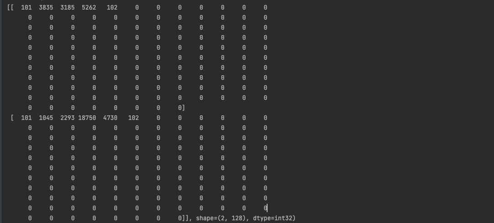
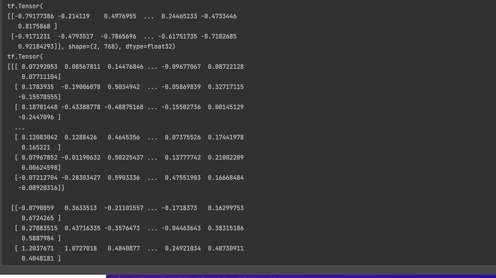

# Classify any tweets related to stocks as either positive,negative or neutral.

<h2><b>First step is to preprocess the text and convert it to word indexes (a 128 sized array) using a pretrained model.</b></h2>

<text> Example of an array for two sample sentences. </text>

<text>The preprocessing model can be changed for further customization.</Text>

<text>Change the preprocess_url variable at the relevant file (Positive_Neutral_Negative_Tweet.py or
Positive_NotPositive.py)</text>

<h2><b>Feed the results into a word2vec model which creates 768 dimensional word embeddings for each of the sentences.</b></h2>

<text> Example of the 768 dimensional word embedding for two sample sentences. </text>

<text> The model used can be changed . Change the encoder_url at the relevant file. </text>

<h2>A dropout layer is used to drop some of the data. Finally , a dense layer of either one neuron or three neuron is created for the output. </h2>

<h2> Dataset downloaded from : https://www.kaggle.com/datasets/sohelranaccselab/stock-market-tweets-data-sentiment-analysis </h2>

<h2> How to run the file </h2>

<text> Clone the current repository. </text>

<text> Change the parameters if further customization needed. </text>

<text> Run Positive_Neutral_Negative_Tweet.py if it is a 3 class classification problem else run Positive_NotPositive.py </text>

<text> The model is created and saved as "tweet_sentiment_classification_1_or_0.h5" if classifying it as either positive or not positive or as "tweet_sentiment_classification_multi_class.h5" </text>

<text> To run predictions on own data , sample predictions are provided in "check.py" . You can customize the code for your own predictions. </text>

